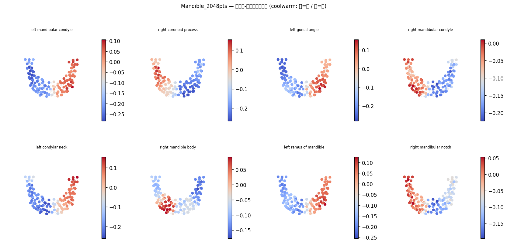
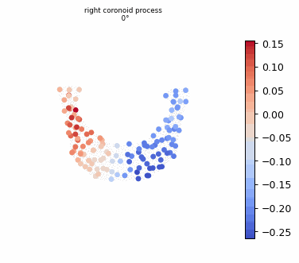
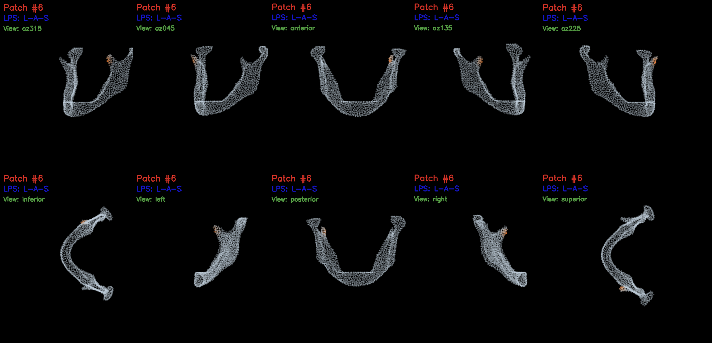

# patch-align-mandible

**Text-guided 3D patch alignment for mandibular anatomy localization**

A two-stage contrastive learning framework that aligns local surface patches of mandible point clouds with anatomical text descriptions. Given a query such as *"left mandibular condyle"*, the model highlights the corresponding region on a 3D scan.

---

## Demo

| Cosine Similarity Map | Anatomy Search |
|:---------------------:|:--------------:|
|  |  |

### Text label example — `Pat 1a_norm / patch 06` (left mandibular condyle)

Each surface patch is described by five LLM-generated anatomy sentences used as contrastive text targets during training.

<p align="center">
  
</p>

| # | Generated text |
|:-:|----------------|
| 1 | Left mandibular condylar process, rounded articular head with smooth convex surface. |
| 2 | Left condyle of mandible, the superior convex process articulating at the TMJ. |
| 3 | Left mandibular head, rounded and expanded articular surface at the ramus apex. |
| 4 | Left condylar process, oval superior projection forming the mandibular articular surface. |
| 5 | Left mandibular condyle, a broad convex process on the posterior ramus end. |

---

## Repository Structure

```
patch-align-mandible/
├── data_pipeline/          # CT → point cloud preprocessing & LLM-assisted text labelling
├── training/               # Stage 3a + 3b training  (ViT-bigG-14, base)
├── training_biomedclip/    # Stage 3b training        (BiomedCLIP backbone)
├── training_text_tune/     # Stage 3a + 3b training   (text encoder fine-tuned)
├── apple_deploy/           # MLX / CoreML / Swift deployment for Apple Silicon
├── assets/                 # Images and animations used in this README
├── requirements.txt
└── README.md
```

---

## Data Pipeline (`data_pipeline/`)

Converts mandible CT meshes into labelled point cloud datasets ready for contrastive training.

```
data_pipeline/
├── config.py                                    # Global path configuration
├── run_phase0.py                                # End-to-end pipeline entry point
├── run_phase0_clip_colab.ipynb                  # Colab notebook version
├── tools/
│   ├── mesh_to_pointcloud.py                    # STL/OBJ → PLY (normalised, 2048 pts)
│   ├── build_anatomy_textbank.py                # Builds anatomy term vocabulary
│   ├── generate_text_candidates.example.py      # Template — copy before use (see below)
│   ├── clip_text_ranker.py                      # CLIP-based text candidate ranking
│   ├── build_patchalign_dataset.py              # Assembles final dataset JSON
│   └── verify_text_labels.py                   # Sanity-check label coverage
└── prompts/
    ├── system_prompt.txt                        # LLM system prompt for anatomy description
    └── user_prompt_template.json                # Per-patch query template
```

### Setting up the LLM text generator

`generate_text_candidates.py` calls an external LLM API and is excluded from the repository.
Copy the example template and register your API key before running:

```bash
cp data_pipeline/tools/generate_text_candidates.example.py \
   data_pipeline/tools/generate_text_candidates.py

# Open the file and set your API key:
#   ANTHROPIC_API_KEY = "sk-ant-..."   # Anthropic Claude
#   or
#   OPENAI_API_KEY = "sk-..."          # OpenAI
```

---

## Contrastive Training (`training*/`)

### Model Architecture


The encoder is built on **PatchAlign3D** (Point Transformer with FPS + KNN grouping).
Training proceeds in two stages:

**Stage 3a — Domain-level InfoNCE**
The full point cloud is divided into local patches. A patch feature vector is pulled toward its matched anatomy text embedding (CLIP-encoded) and pushed away from unmatched ones via InfoNCE contrastive loss. This stage establishes coarse anatomical grounding.

**Stage 3b — Local patch BCE + Knowledge Distillation + EWC**
Each patch is classified against a fixed set of 16 anatomy labels with binary cross-entropy. Knowledge Distillation (KD) preserves the CLIP teacher's soft targets, and Elastic Weight Consolidation (EWC) prevents catastrophic forgetting of Stage 3a representations. Text augmentation selects one of five paraphrases per label per epoch.

### Variant Comparison

| Folder | CLIP Backbone | Text Dim | Stages | Key Difference |
|--------|--------------|:--------:|:------:|----------------|
| `training/` | ViT-bigG-14 (LAION-2B) | 1280 | 3a → 3b | Base pipeline |
| `training_biomedclip/` | BiomedCLIP (MS PubMedBERT + ViT-B/16) | 512 | 3b only | Skips Stage 3a; initialises from a Stage 2 checkpoint; biomedical language model |
| `training_text_tune/` | ViT-bigG-14 / BiomedCLIP | 1280 / 512 | 3a → 3b | Text encoder fine-tuned jointly with the point encoder |

### Running Training (Colab)

Each training folder contains a ready-to-run Colab notebook:

```
training/phase3_training.ipynb
training_biomedclip/phase3_training.ipynb
training_text_tune/phase3_training_bigG14.ipynb
```

Or run from the command line:

```bash
cd training/
python train_stage3a.py --config configs/stage3a.yaml
python train_stage3b.py --config configs/stage3b.yaml \
    --stage3a_ckpt outputs/stage3a/stage3a_last.pt
```

---

## Apple Silicon Deployment (`apple_deploy/`)

Trained weights are converted to run natively on Apple Silicon via **MLX** (Mac demo) and
**CoreML + Swift** (iOS / visionOS). A visionOS immersive-space app (`PatchSimlilarySpace`)
visualises anatomy search results on a 3D mandible model in real time.

| Component | Description |
|-----------|-------------|
| Python + MLX | Mac inference demo — anatomy search from a PLY file |
| `DentalInferenceKit` | Swift Package wrapping the CoreML point encoder and CLIP text encoder |
| `PatchSimlilarySpace` | visionOS app — immersive 3D anatomy viewer for Apple Vision Pro |

[](https://youtu.be/dWb9BIXHC7Q)

For the full weight conversion pipeline, file placement guide, and Xcode setup instructions,
see **[`apple_deploy/README.md`](apple_deploy/README.md)**.

---

## Getting Started

### Prerequisites

- Python 3.10 or 3.11
- CUDA 11.8+ GPU (training) — Google Colab A100 recommended
- Apple Silicon Mac (deployment, optional)

### Install

```bash
git clone https://github.com/<your-username>/patch-align-mandible.git
cd patch-align-mandible

pip install -r requirements.txt

# Additional manual installs:
pip install "git+https://github.com/erikwijmans/Pointnet2_PyTorch.git#egg=pointnet2_ops&subdirectory=pointnet2_ops_lib"
pip install https://github.com/unlimblue/KNN_CUDA/releases/download/0.2/KNN_CUDA-0.2-py3-none-any.whl
```

### Dataset

Download the Mandibular CT Dataset from Figshare and extract STL files to
`Dataset/6167726/STLs/STLs/` relative to the project root:

```
https://doi.org/10.6084/m9.figshare.6167726.v6
```

Then run the data pipeline:

```bash
python data_pipeline/run_phase0.py
```

---

## References

**Method**

- **PatchAlign3D** — patch-level 3D point cloud encoder used as the backbone in this work.

**Dataset**

- Wallner, Jürgen; Egger, Jan (2018). **Mandibular CT Dataset Collection**. *figshare*. Dataset.  
  <https://doi.org/10.6084/m9.figshare.6167726.v6>

**Related work**

- ULIP / PointLLM — 3D–language pre-training frameworks that inspired the contrastive alignment approach.
- BiomedCLIP — Microsoft biomedical vision-language model used as an alternative text encoder.  
  `hf-hub:microsoft/BiomedCLIP-PubMedBERT_256-vit_base_patch16_224`
